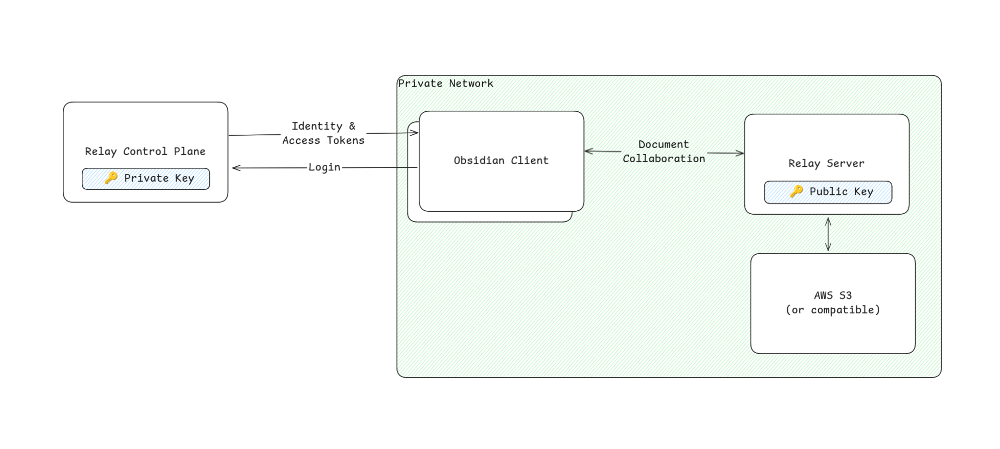

# Hosting an on-premise Relay Server

[Relay](https://relay.md) supports self-hosting your Relay Server for added privacy.

While you cannot self-host the entire Relay service, hosting an on-premise Relay Server provides you with full privacy for your documents and attachments.
Relay's Control Plane handles login and permissions management, but is unable to read the contents of your documents.

The simplest setup for personal use is to host a Relay Server with Docker Compose and use Minio (self-hosted S3-compatible API) for data persistence.


## Contact Us
Contact us to get an auth token for your on-premise Relay Server.


discord: [https://discord.system3.md](https://discord.system3.md)

email: daniel@system3.md


## Security Architecture



When hosting an on-premise Relay Server there is an auth token that is shared between the Relay Control Plane and your Relay Server.
The shared auth token allows the Relay control plane to issue tokens which grants users access your Relay Server.

It is technically possible for the Relay control plane to issue an access token and then use it to connect to your Relay Server if it is hosted on the public internet.

**To ensure that your documents are fully private, you need to host your Relay Server on a private network such as a tailscale tailnet or a corporate VPN.**
**If you don't already have a private network set up, we recommend using tailscale.**

Whenever you change the URL of your server, you will need to update RELAY_SERVER_URL_PREFIX to your new url and notify us.


## Hosting with Docker
Before we can start the Relay Server container, we need to configure the environment.
This `auth.env` file is a template for all of the variables that you need to set.

```auth.env
# Auth Token from Relay Team (contact daniel@system3.md)
RELAY_SERVER_AUTH=${AUTH_TOKEN}

# Cloudflare R2
AWS_ACCESS_KEY_ID=${AWS_ACCESS_KEY_ID}
AWS_SECRET_ACCESS_KEY=${AWS_SECRET_ACCESS_KEY}
AWS_REGION=auto
STORAGE_BUCKET=${BUCKET}
AWS_ENDPOINT_URL_S3=https://${CLOUDFLARE_ACCOUNT_ID}.r2.cloudflarestorage.com
RELAY_SERVER_STORAGE=s3://${BUCKET}/

# Tailscale
TAILSCALE_AUTHKEY=${TAILSCALE_AUTHKEY}
TAILSCALE_USERSPACE_NETWORKING=true

# Tailscale Tailnet Address
RELAY_SERVER_URL_PREFIX=http://relay-server.${TAILNET_NAME}.ts.net:8080
```

Once you have all of the environment variables configured you can run the server with docker.
This command runs the server interactively so you can check the logs to ensure that the server starts successfully.

```bash
docker run -it \
  --name relay-server \
  --env-file auth.env \
  docker.system3.md/relay-server
```

## S3-compatible storage

Relay Server is built to store data to S3-compatible storage.
You will find examples in this repo that use:
- [AWS S3](https://aws.amazon.com/s3/)
- [Cloudflare R2](https://www.cloudflare.com/developer-platform/products/r2/)
- [MinIO](https://min.io) (self-hosted)
- [Tigris](https://www.tigrisdata.com/docs/) (great for fly.io)

## Example Configuration

### Docker Compose
Templates:

[Tailscale (http) with MinIO](templates/docker-compose/minio-tailscale.yaml)

[Custom VPN with MinIO](docker-compose.yaml)


### Docker
Templates:

[Tailscale (http) with R2](templates/docker-r2-tailscale.md)

[Tailscale (https) with R2](templates/docker-r2-tailscale-serve.md)

[Tailscale (http) with S3](templates/docker-s3-tailscale.md)

[Tailscale (https) with S3](templates/docker-s3-tailscale-serve.md)

[Custom VPN with S3](templates/docker-s3-custom.md)

[Custom VPN with R2](templates/docker-r2-custom.md)


### Fly.io
Instructions: [fly.io hosting](FLY.md)

Templates:

[Tailscale (http) with R2](templates/fly-r2-tailscale.md)

[Tailscale (https) with R2](templates/fly-r2-tailscale-serve.md)

[Tailscale (http) with S3](templates/fly-s3-tailscale.md)

[Tailscale (https) with S3](templates/fly-s3-tailscale-serve.md)

[Custom VPN with S3](templates/fly-s3-custom.md)

[Custom VPN with R2](templates/fly-r2-custom.md)

### Kubernetes

[Kubernetes with Tigris + Azure Key Vault](https://github.com/No-Instructions/relay-server-template/tree/main/templates/kubernetes)

# Acknowledgements

The Relay Collaboration Server is a fork of [y-sweet](https://github.com/jamsocket/y-sweet) by the talented folks at jamsocket.com

y-sweet builds on [y-crdt](https://github.com/y-crdt/y-crdt) by Bartosz Sypytkowski, Kevin Jahns, and the y-crdt community.

The server source code is MIT licenced and available [here](https://github.com/no-instructions/y-sweet).
